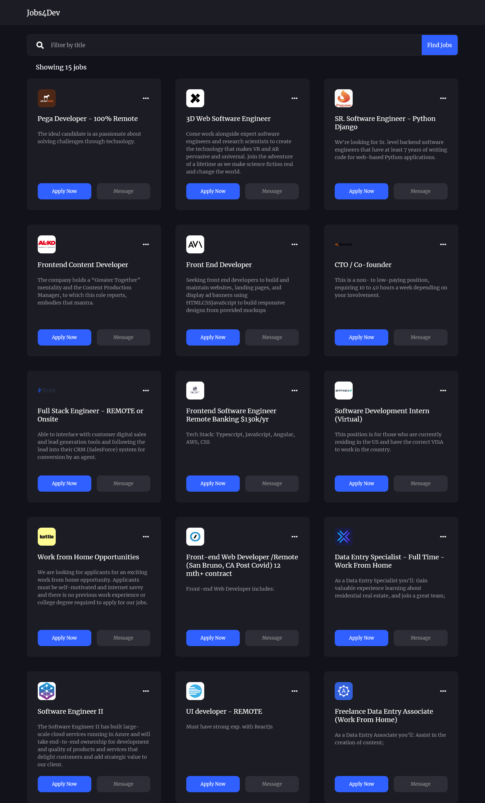

# Jobs4Dev
A jobs listing website for developers.

Built with HTML, CSS & Javascript. The job listings are gotten from a JSON file which contains 15 jobs. Fetch API is used in getting the data from the JSON file which is then rendered onto the webpage.

## Shots

## Live URL
https://jobs4dev.netlify.app/